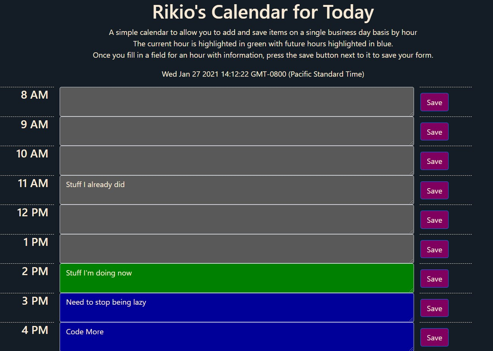

# calendar

**Name**: Rikio's daily calendar

Description and usage: This daily calendar is for an individuals single day event management. The calendar accounts for a work day's worth of hours between 8AM-6PM. This calendar is used by typing in data in the respective hour's text field. Once you have filled out the information you want to save, you press the adjacent save button to the right of the information field. Any hour that has passed will be grayed out but will still be accessible. The current hour is highlighted green and future hours are highlighted in blue. This site will save your data locally and will be populated with your previously saved data the next time you visit the website if it is during the same day. This website is refreshed and your locally saved data will be wiped every day at midnight PST.

**Visuals**:  This image shows the example of the calendar in use.

**Technologies used**: HTML, Javascript, CSS, JQuery

**Link to deployed application**: https://rikioh.github.io/calendar/

**Expected behavior/acceptance criteria of javascript code**:

GIVEN I am using a daily planner to create a schedule 
WHEN I open the planner 
THEN the current day is displayed at the top of the calendar 
WHEN I scroll down 
THEN I am presented with time blocks for standard business hours 
WHEN I view the time blocks for that day 
THEN each time block is color-coded to indicate whether it is in the past, present, or future 
WHEN I click into a time block 
THEN I can enter an event 
WHEN I click the save button for that time block 
THEN the text for that event is saved in local storage 
WHEN I refresh the page 
THEN the saved events persist

